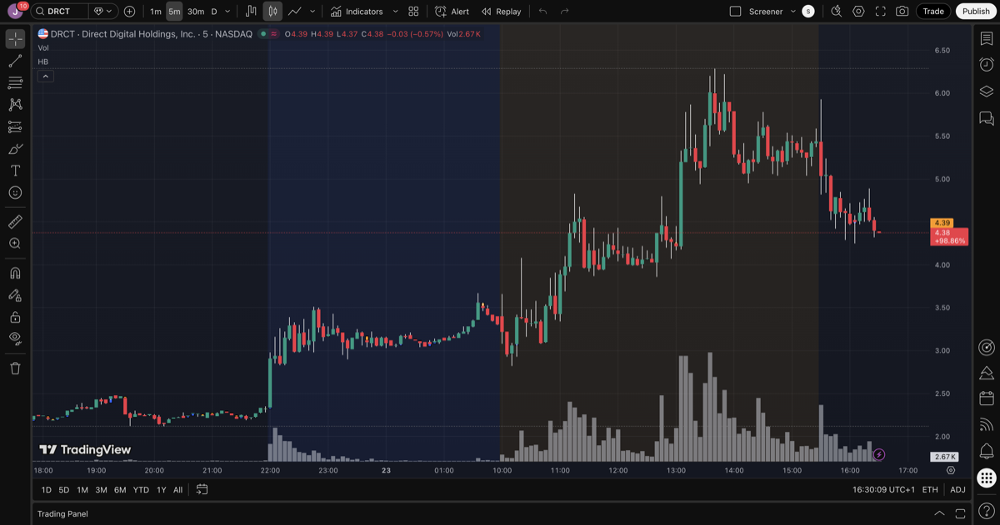
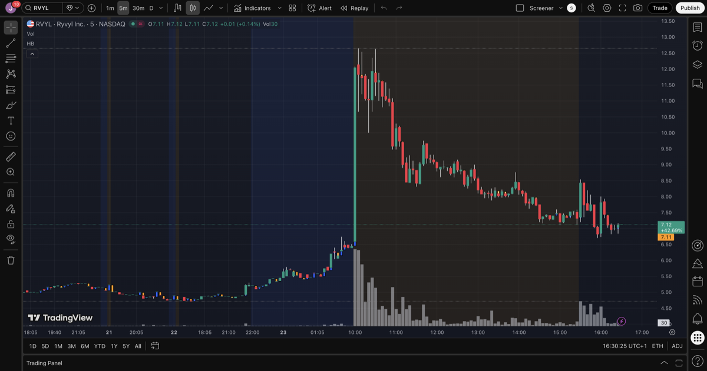
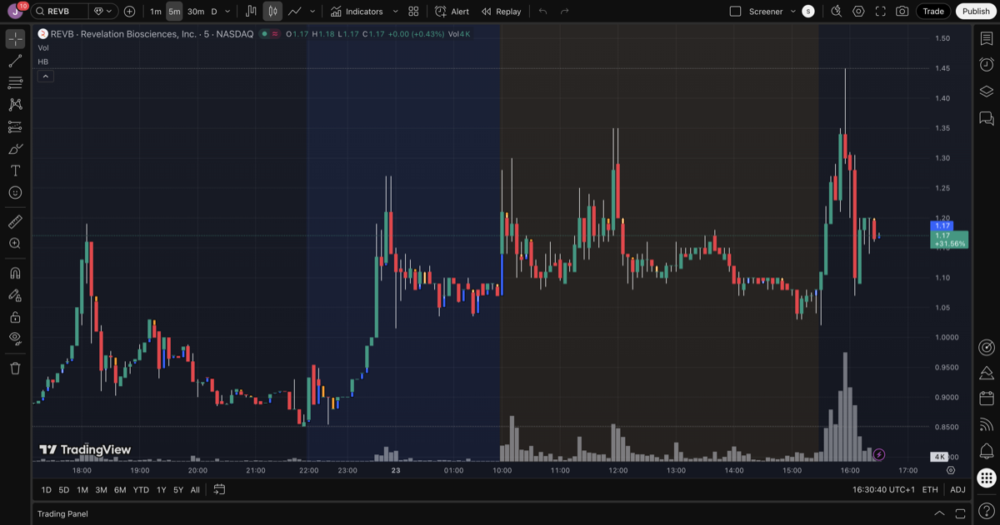
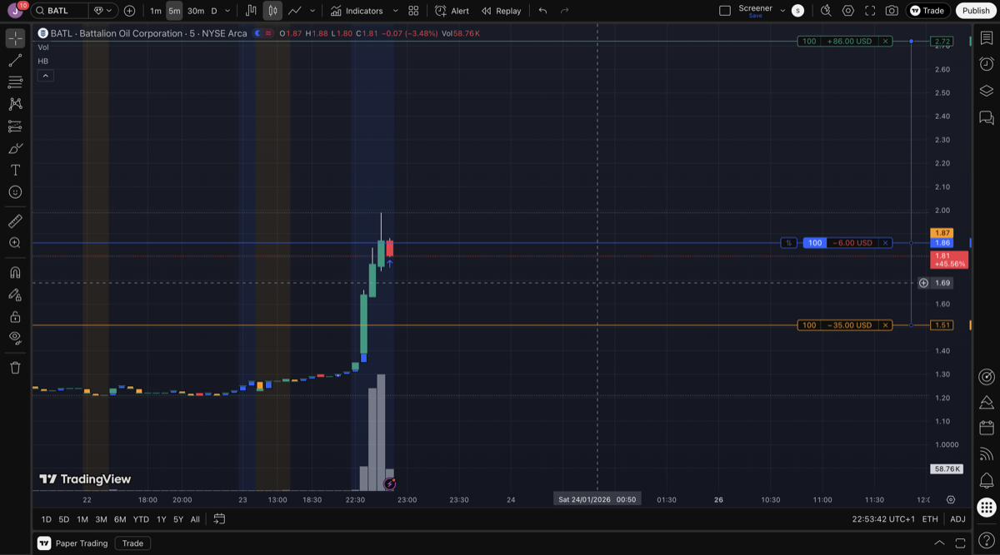
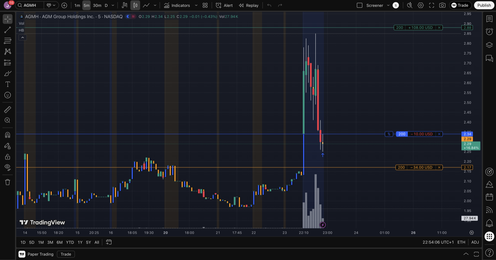

# 2026-01-23

## Morning Analysis

**Candidates Screened:**
| Ticker | Sector | Change | Rel Vol | Catalyst |
|--------|--------|--------|---------|----------|
| DRCT | Advertising | +128% | 1330x | Short squeeze (no news) |
| RVYL | Software | +56% | 705x | Merger S-4 / NASDAQ compliance (old news) |
| REVB | Biotech | +30% | 915x | FDA pathway agreement (Jan 21) |

**Initial Grades:**
- DRCT: A (strongest price action, active squeeze)
- RVYL: C (early spike dumped, old news)
- REVB: B (right sector, real catalyst, weak premarket)

**Actual Performance by 10:00 AM:**
| Ticker | Prev Close | High | Current | From Prev |
|--------|------------|------|---------|-----------|
| DRCT | $2.31 | $6.04 | $4.41 | +91% |
| RVYL | $5.24 | $8.55 | $7.48 | +43% |
| REVB | $0.85 | $1.45 | $1.25 | +46% |

## Trade | DRCT | Long

| Field | Value |
|-------|-------|
| Entry | $4.19 |
| Stop Loss | $3.64 (-13.1%) |
| Take Profit | $6.00 (+43.2%) |
| Shares | 100 |
| R:R | 3.3:1 |
| Status | Open |

**Setup:** Short squeeze - low float (1.27M), elevated short interest, explosive premarket volume.

**Catalyst:** Short squeeze triggered by unusual volume in low-float stock. No fundamental news.

**Grade:** A

**Execution Log:**
| Time | Price | Event |
|------|-------|-------|
| ~8:00 AM | $4.19 | Entry |
| ~8:30 AM | $6.04 | Day high (TP not triggered - premarket) |
| ~10:00 AM | $4.41 | Pullback after open |

**Notes:**
- Premarket high: $4.93, then extended to $6.04
- TP of $6.00 was hit but didn't execute (premarket limitation)
- Price gave back most gains after market open
- Peak P&L: +$185 (+44%), Current P&L: ~+$22 (+5%)

## Charts

## After-Hours Analysis (~4:50 PM ET)

**Source:** TradingView After-Hours Gainers

| Ticker | Close | AH Price | AH Change | AH Volume | Interest |
|--------|-------|----------|-----------|-----------|----------|
| **BATL** | $1.28 | $1.93 | **+51%** | Active | **HIGH** |
| **AGMH** | $2.14 | $2.28-2.84 | +10-30% | Heavy | **HIGH** |
| SLGB | $1.22 | $1.41 | +16% | Moderate | Medium |
| SLE | $5.90 | $6.40 | +8% | Sparse | Low |
| SQFT | $3.27 | $3.52-3.67 | +10% | Very Low | Low |
| SMXT | $0.73 | $0.79 | +8% | Low | Low |

### Top Candidates for Tomorrow

**1. BATL (Battalion Oil)** - Best candidate
- Massive AH spike: $1.28 → $1.93 (+51%)
- Active post-market volume with consistent buying
- Regular session quiet (106K vol), AH exploding
- Fits micro-cap, <$10 criteria
- [TradingView Chart](https://www.tradingview.com/chart/?symbol=BATL)

**2. AGMH (AGM Group Holdings)** - Strong volume
- AH range: $2.20 - $2.84 (spiked +33%)
- Heavy volume burst (678K+ in single AH minute)
- Has "unusual volume + price increase" pattern
- [TradingView Chart](https://www.tradingview.com/chart/?symbol=AGMH)

**3. SLGB (Smart Logistics)** - Moderate
- AH: $1.22 → $1.41 (+16%)
- Decent volume, lower price point
- [TradingView Chart](https://www.tradingview.com/chart/?symbol=SLGB)

### Charts

---

## Trade | BATL | Long (After-Hours)

| Field | Value |
|-------|-------|
| Entry | $1.86 |
| Stop Loss | $1.51 (-18.8%) |
| Shares | 100 |
| Status | **Closed** |
| Exit | ~$2.40 |
| P&L | ~+$54 (+29%) |

**Setup:** After-hours momentum - massive AH spike from $1.28 to $1.93 (+51%), active volume.

**Catalyst (4:35 PM):** Battalion Oil terminated gas treating agreement for WAT AGI Facility, shifted Monument Draw gas volumes to new large-cap midstream processor, driving ~1,200 bbl/d month-to-date increase in January oil production vs December. Operational improvement.

**Post-Trade Analysis:**
- Sold around $2.40 for a win
- Stock continued to **$7.00 in premarket on Jan 26** (+276% from entry)
- Then dumped to $2.55 after open
- **Lesson:** The biggest move happened in premarket. Consider holding AH positions through to premarket exit.

---

## Trade | AGMH | Long (After-Hours)

| Field | Value |
|-------|-------|
| Entry | $2.29 |
| Stop Loss | $2.17 (-5.2%) |
| Shares | 200 |
| Status | Open |

**Setup:** After-hours momentum - heavy volume burst (678K+), price spiked to $2.84 (+33%).

**Catalyst (4:15 PM):** AGM Group Holdings entered US$25M equity line of credit facility with institutional investor, issued 5-year warrant for 608,777 shares at $2.4639. Financing deal - provides cash runway but dilution risk.

---

### Notes
- Used TradingView After-Hours Gainers screener: https://www.tradingview.com/markets/stocks-usa/market-movers-after-hours-gainers/
- Finviz screener only shows regular session data, not AH
- Yahoo Finance API confirmed to provide real-time AH data (no 15-min delay)
