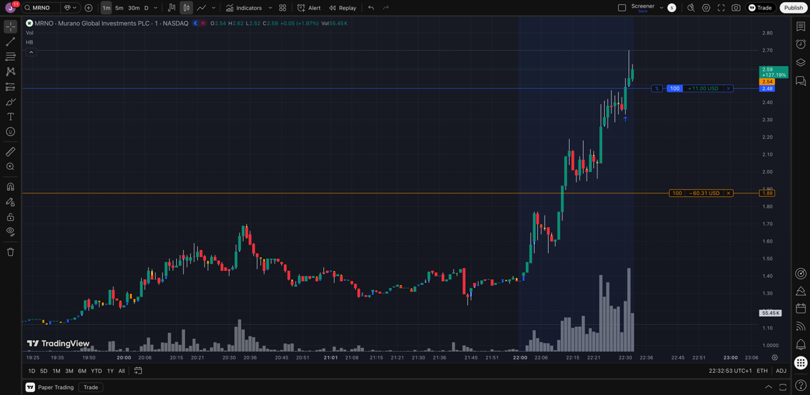
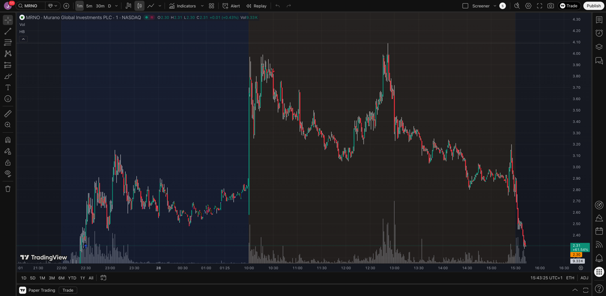

# Trading Log - 2026-01-27

## Trade Executed

**MRNO - Murano Global Investments** (Paper Trade) - CLOSED

| Field | Value |
|-------|-------|
| Entry | $2.48 |
| Exit | $3.80 |
| Shares | 100 |
| Position Size | $248 |
| Stop Loss | $1.88 (-24%) |
| Take Profit | $4.49 (+81%) |
| Risk | $60 |
| Reward | $201 |
| R:R | 1:3.35 |
| **Result** | **+$132 (+53.2%)** |

**Rationale:** Low float (1.35M), unusual volume, BTC treasury catalyst, strong AH momentum.

**Exit Notes (Jan 28 premarket):**
- Sold at $3.80 during premarket consolidation near $4.00 resistance
- No new catalyst - running on momentum/squeeze only
- Decided to lock in profits rather than risk rejection at resistance
- Short interest had increased to 17.38% (was 0.96% at entry)

**Post-Trade Review (Jan 28 after open):**

What happened at market open:
- Premarket: Price consolidated around $2.80-$3.50
- At open: Brief spike to **$4.10** (would have been +65% from entry)
- Post-open: Sharp rejection, crashed to **$2.40** within 2-3 hours (-40% from peak)
- End of day: Trading at $2.31

**Key Takeaway:** Exit at $3.80 premarket was correct decision. Holding through open hoping for $4.49 target would have resulted in a loss. This validates the trading plan insight: "Momentum stocks often peak in premarket, then dump at open."

---

## Screener Notes

**Finviz:** Didn't find anything good today. The unusual volume screener considers too many days - misses stocks that just started moving.

**TradingView After-Hours Gainers:** Found MRNO here. Better for catching fresh moves.

**Lesson:** TradingView AH screener is better for finding stocks that just started their move today.

---

## After-Hours Screener Review

Reviewed after-hours gainers from TradingView screener (found MRNO here).

---

## ZNB - Zeta Network Group

**Setup:**
| Metric | Value | Note |
|--------|-------|------|
| Price | $0.99 | **+62%** |
| Previous Close | $0.61 | |
| Float | 146M | HIGH - not ideal |
| Market Cap | $145M | |
| Short Float | 1.01% | Low |
| Sector | Entertainment | |
| Rel Volume | 13.6x | |

**Catalyst:**
- No fresh news today
- Company rebranded from Color Star Technology (Aug 2025)
- Pivoted to Bitcoin/crypto investments
- Recent news: SOLV Foundation partnership (Oct 2025)

**Intraday Action:**
- Flat premarket (~$0.61-0.65)
- Slow grind most of day around $0.62-0.64
- Late session explosion: $0.62 -> $1.00 in last ~30 min
- Post-market pullback to $0.86-0.89

**Grade:** C
**Decision:** Skip
**Reason:** High float (146M), no catalyst, already had big move, post-market selling. Some unusual volume but float kills it.

---

## MRNO - Murano Global Investments

**Setup:**
| Metric | Value | Note |
|--------|-------|------|
| Price | $1.36 | **+56%** |
| Float | **1.35M** | LOW FLOAT |
| Market Cap | $108M | |
| Short Float | 0.96% | |
| Insider Own | 98.3% | Very high |
| Sector | Real Estate | |
| Rel Volume | 24x | Very high |

**Catalyst:**
- Bitcoin Treasury strategy with $500M SEPA (Jul 2025)
- Finviz: "Retail speculation on short squeeze potential"

**Intraday Action:**
- Strong momentum throughout day
- Post-market spiking to $2.06-2.28 (+50-68% from close!)

**Grade:** B
**Decision:** Watch
**Reason:** Excellent low float + clear unusual volume on chart. Best setup of the four. Already ran hard though - entry risky. Watch for premarket continuation.

---

## ABOS - Acumen Pharmaceuticals

**Setup:**
| Metric | Value | Note |
|--------|-------|------|
| Price | $2.72 | **+31%** |
| Float | 46.32M | Higher |
| Market Cap | $165M | |
| Short Float | 1.20% | |
| Sector | Biotech | Alzheimer's |
| Target Price | $7.00 | BTIG |
| Analyst Rating | 1.00 | All Buy |

**Catalyst:**
- BTIG price target hike to $7 (Jan 25, 2026)
- Phase 2 Alzheimer's trial (sabirnetug)

**Intraday Action:**
- Gapped up premarket on analyst news
- Steady climb throughout day
- Post-market: $2.96-3.32 (+9-22% more)

**Grade:** C
**Decision:** Skip
**Reason:** Real catalyst but volume looks normal on chart. Float too high. Not the explosive setup we want.

---

## NINE - Nine Energy Service

**Setup:**
| Metric | Value | Note |
|--------|-------|------|
| Price | $0.63 | **+20%** |
| Float | 37.73M | Higher |
| Market Cap | $27M | Micro |
| Short Float | 8.28% | Higher |
| Sector | Oil & Gas | |

**Catalyst:**
- No clear catalyst (per Finviz)
- NYSE delisting notice (May 2025)

**Intraday Action:**
- Gradual climb throughout day
- Post-market: $0.66-0.68 (modest +5-8%)

**Grade:** C
**Decision:** Skip
**Reason:** No catalyst, high float, delisting risk, weak post-market action, normal volume on chart

---

## Summary

| Stock | Change | Float | Catalyst | AH Action | Volume | Grade |
|-------|--------|-------|----------|-----------|--------|-------|
| MRNO | +56% | **1.35M** | BTC treasury | Running | **Unusual** | B |
| ZNB | +62% | 146M | None | Selling | Somewhat | C |
| ABOS | +31% | 46M | Analyst PT | Strong | Normal | C |
| NINE | +20% | 38M | None | Flat | Normal | C |

**Chart Review Notes:**
- MRNO: Clear unusual volume spike on chart
- ZNB: Some unusual volume visible
- ABOS: Volume looks normal despite the move
- NINE: Volume looks normal

**Best Setup:** MRNO is the only one with low float + unusual volume, but already extended. Watch for premarket continuation tomorrow.
