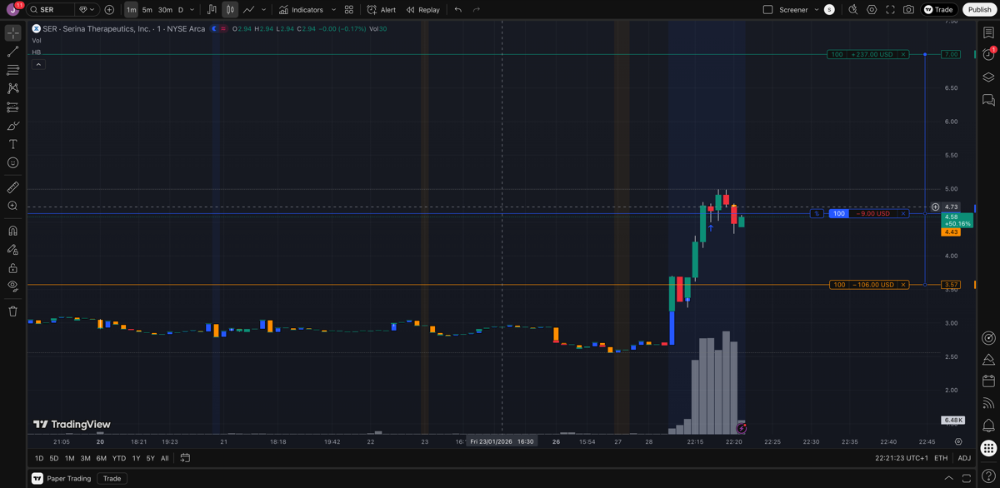

# Trading Log - 2026-01-28 (Wednesday)

## Morning Analysis

**Time:** After-hours screening
**Market conditions:** Multiple AH movers with catalysts

---

## Screener Candidates

| Ticker | Float | MCap    | AH Move | Sector  | Grade | Decision |
|--------|-------|---------|---------|---------|-------|----------|
| SER    | 5.4M  | $28.4M  | +51%    | Biotech | A-    | Watch    |
| XPON   | 9.2M  | $8.7M   | +41%    | Indust. | B     | Watch    |
| CDIO   | 1.7M  | $3.2M   | +11%    | Biotech | C+    | Watch    |

---

## Detailed Analysis

## SER - Serina Therapeutics Inc - 2026-01-28

**Setup:**
- Float: 5.39M
- Market Cap: $28.37M
- Sector: Healthcare/Biotechnology
- Previous Close: $2.74
- Regular Close: $2.72
- AH High: $4.12 (+51%)

**Catalyst:**
- FDA Clearance of IND Application for SER-252 for Treatment of Advanced Parkinson's Disease (4:12 PM)

**Analysis:**
- LOW FLOAT - matches trading plan criteria
- BIOTECH SECTOR - matches trading plan
- Major FDA catalyst (IND clearance allows clinical trials)
- Analyst target $15 (H.C. Wainwright)
- Recent positive FDA feedback on trial design

**Concerns:**
- NYSE deficiency notification (equity issues)
- Heavy insider selling (CSO selling regularly)
- AH move already happened

**Grade:** A-
**Decision:** Top candidate - biotech + FDA catalyst + low float

---

## XPON - Expion360 Inc - 2026-01-28

**Setup:**
- Float: 9.20M
- Market Cap: $8.72M
- Sector: Industrials (Electrical Equipment)
- Previous Close: $0.856
- Regular Close: $0.902
- AH High: $1.36 (+59%)
- AH Current: ~$1.21 (+41%)

**Catalyst:**
- Preliminary 2025 Financial Results - projecting ~$9.6M revenue (4:01 PM)

**Analysis:**
- Fresh news catalyst
- Regular session volume 7.5M vs 844K avg (9x normal)
- Micro-cap with momentum

**Concerns:**
- Float higher than ideal (9.2M vs <5M preferred)
- NOT biotech sector
- Financial results less exciting than FDA news

**Grade:** B
**Decision:** Secondary candidate - catalyst but wrong sector, higher float

---

## CDIO - Cardio Diagnostics Holdings Inc - 2026-01-28

**Setup:**
- Float: 1.70M
- Market Cap: $3.22M
- Sector: Healthcare/Biotechnology
- Previous Close: $1.84
- Regular Close: $1.78
- AH High: $2.31 (+26%)
- AH Current: ~$1.98 (+11%)

**Catalyst:**
- No fresh catalyst today
- Recent: India partnership for PrecisionCHD test (Jan 7)

**Analysis:**
- EXTREMELY LOW FLOAT (1.7M) - best of all candidates
- Biotech sector matches plan
- Short interest 7.86% (squeeze potential)
- Near 52-week low ($1.64)

**Concerns:**
- NO FRESH CATALYST - AH move appears sympathy-driven
- Stock down 86% over past year
- Recent reverse split (May 2025)
- Risky without news driver

**Grade:** C+
**Decision:** Watch only - amazing float but no catalyst

---

## Trade Execution

**Entry:**
- Ticker: SER
- Time: ~22:21 Berlin (16:21 ET) - After Hours
- Price: $4.63
- Size: ~100 EUR
- Reason: FDA IND clearance catalyst, biotech sector, low float

**Exit:**
- Time: 
- Price: 
- P/L: 
- Reason: 

---

## Notes

- SER is top candidate: biotech + FDA IND clearance + low float
- Entry at $4.63 (+69% from prev close $2.74)
- AH High so far: $5.02
- Watch premarket tomorrow for continuation or exit
