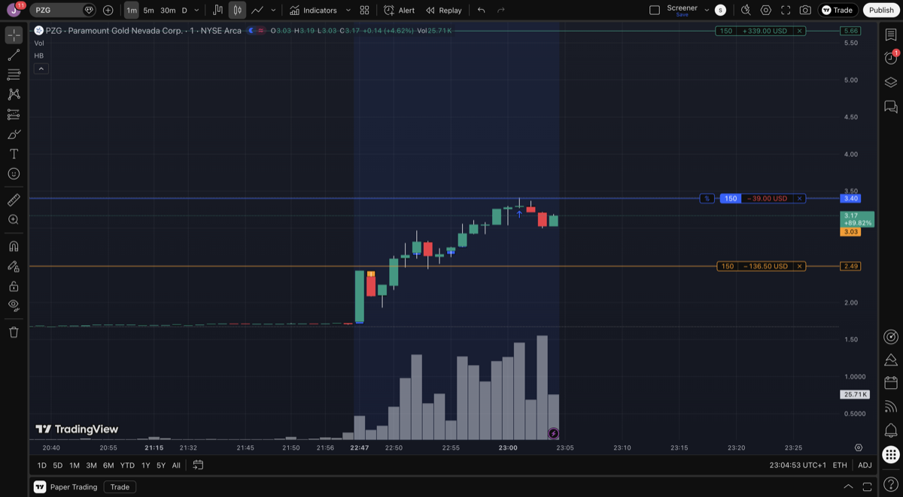
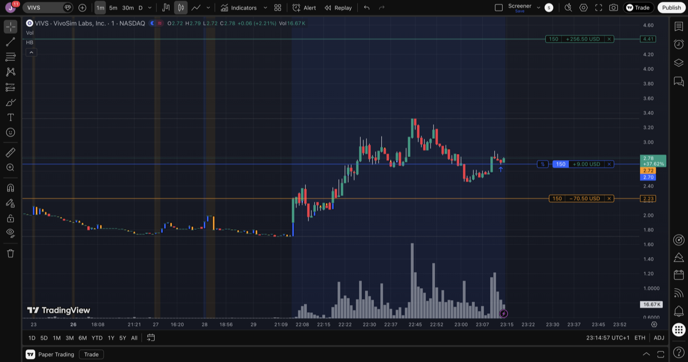

# Trade Log - 2026-01-29

## Morning Analysis

Market closes at 22:00 Berlin / 4:00 PM ET today.

---

## PZG - Paramount Gold Nevada Corp

**Setup:**
- Float: 61.83M (too high for ideal momentum play)
- Market Cap: $135.56M
- Sector: Gold (Basic Materials)
- Previous Close: $1.80
- Regular Session Close: $1.73 (-3.89%)
- After-Hours: $3.22 (+86%)
- Rel Volume: 4.11

**Catalyst:**
- **Today 4:47 PM ET**: Federal Record of Decision approving Grassy Mountain Gold Project - project now "shovel-ready"
- This is a major regulatory milestone after years of permitting

**After-Hours Action:**
| Time (approx) | Price | Notes |
|---------------|-------|-------|
| 4:04 PM | $1.73 | Regular close |
| 4:11 PM | $2.43 | First spike on news |
| 5:00 PM | $2.57 | Building |
| 5:15 PM | $2.80 | Continued momentum |
| 5:45 PM | $3.12 | Near high |
| Latest | $3.22 | After-hours high |

**Concerns:**
- NOT biotech - gold mining sector
- Float is quite large (61.83M) - harder to squeeze
- Already moved +86% in after-hours - may have topped

**Grade:** B
**Decision:** Watch
**Reason:** Strong catalyst but large float and not our usual sector. Price already moved significantly AH.

---

## VIVS - VivoSim Labs Inc

**Setup:**
- Float: 2.58M (LOW FLOAT!)
- Market Cap: $4.43M (micro cap)
- Sector: Biotechnology (Healthcare) - FITS TRADING PLAN
- Previous Close: $1.73
- Regular Session Close: $1.70 (-1.73%)
- After-Hours: $2.75 (+62%)
- Rel Volume: 13.07 (VERY HIGH)
- Short Float: 0.33% (low)

**Catalyst:**
- **Today 4:05 PM ET**: New distributor agreements with JCBio (Korea) and Tekon Biotech (China) for NAMKind toxicology services
- Expanding into Asia-Pacific market

**After-Hours Action:**
| Time (approx) | Price | Notes |
|---------------|-------|-------|
| 4:00 PM | $1.70 | Regular close |
| 5:00 PM | $2.16 | First spike |
| 5:15 PM | $2.35 | Building |
| 5:30 PM | $2.44 | Continued |
| 5:45 PM | $3.03 | Near high |
| Latest | $2.75 | Some consolidation |

**Positives:**
- LOW FLOAT (2.58M) - ideal for momentum
- Biotech sector - matches trading plan
- Fresh news catalyst
- Huge relative volume (13.07x)

**Concerns:**
- Distributor agreement is modest news (not FDA, not clinical)
- Already up 62% after-hours

**Grade:** A
**Decision:** Watch for premarket action
**Reason:** Best fit for trading plan. Low float biotech with fresh catalyst and massive volume.

---

## FAT - FAT Brands Inc

**Setup:**
- Float: 5.76M
- Market Cap: $4.36M (micro cap)
- Sector: Restaurants (Consumer Cyclical)
- Previous Close: $0.25
- Regular Session Close: $0.22 (-13.23%)
- After-Hours: $0.28 (+27%)
- Rel Volume: 25.84 (EXTREMELY HIGH)
- Short Float: 19.13% (HIGH!)

**Catalyst:**
- **Jan 26-27**: Filed Chapter 11 bankruptcy
- Owner of Fatburger, Johnny Rockets, Twin Peaks, Round Table Pizza
- Received Nasdaq delisting notice earlier this month

**After-Hours Action:**
| Time (approx) | Price | Notes |
|---------------|-------|-------|
| 4:00 PM | $0.22 | Regular close |
| 5:00 PM | $0.30 | Spike |
| 5:15 PM | $0.36 | Continued |
| 5:30 PM | $0.44 | Building |
| 5:45 PM | $0.32 | Some pullback |
| Latest | $0.28 | Consolidating |

**Concerns:**
- BANKRUPTCY - extremely risky
- Not biotech sector
- Delisting risk
- Highly volatile due to headline risk

**Grade:** C
**Decision:** Skip
**Reason:** Bankruptcy play is pure gambling. Not suitable for the trading plan.

---

## Watchlist Summary

| Grade | Ticker | Action | Key Reason |
|-------|--------|--------|------------|
| A | VIVS | Watch PM | Low float biotech, fresh catalyst |
| B | PZG | Watch | Good catalyst but large float, gold sector |
| C | FAT | Skip | Bankruptcy - too risky |

## Notes

VIVS is the only candidate that fits the trading plan criteria (biotech, low float). Monitor premarket action starting 10:00 Berlin / 4:00 AM ET.

---

## Trade Execution

### Entry

**PZG** @ $3.40 (after-hours)

| Field | Value |
|-------|-------|
| Shares | 150 |
| Entry | $3.40 |
| Stop Loss | $2.49 (-26.8%) |
| Take Profit | $5.66 (+66.5%) |
| Position Size | $510 |
| Risk | $136.50 |
| Reward | $339 |
| R:R | 2.5:1 |

- Bought on federal approval catalyst
- Entry after significant AH run-up from $1.73 close

---

**VIVS** @ $2.70 (after-hours)

| Field | Value |
|-------|-------|
| Shares | 150 |
| Entry | $2.70 |
| Stop Loss | $2.23 (-17.4%) |
| Take Profit | $4.41 (+63.3%) |
| Position Size | $405 |
| Risk | $70.50 |
| Reward | $256.50 |
| R:R | 3.6:1 |

- Bought on Asia-Pacific distributor deal catalyst
- Low float biotech - fits trading plan
- Spiked to ~$3.33, consolidated to entry zone

### Exit

### P&L

### Lessons

