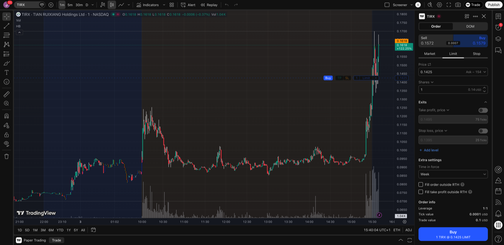
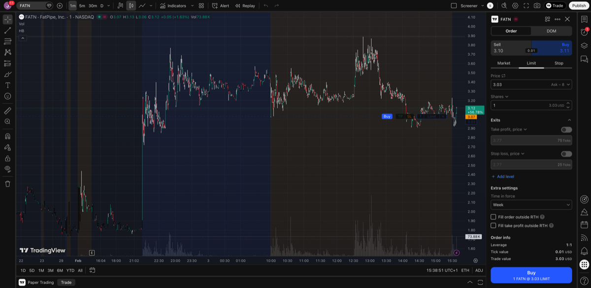
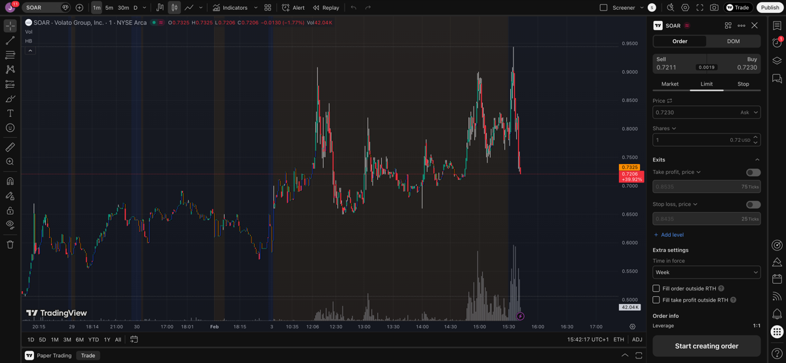

# 2026-02-03 - Morning Analysis

## Screener Results (9:35 AM ET)

| Ticker | Name | Change | Sector |
|--------|------|--------|--------|
| FATN | FatPipe, Inc. | +71.74% | Tech/Networking |
| TIRX | TIAN RUIXIANG Holdings | +64.15% | Financial Services |
| INLF | INLIF LIMITED | +45.66% | Industrials |
| SOAR | Volato Group | +31.66% | Aviation |

## Notes

### TIRX

This could have worked, but could only have detected it in early premarket. Volume is still there, maybe still interesting.

### INLF

Already had a spike yesterday and didn't hold. Dead cat bounce.

### FATN

There's no way we could have caught that one — instantly went up in premarket and then no more changes till now.

### SOAR

Interesting, not sure what to make of it. Gapped up at open, spiked to $0.95, now choppy around $0.73.

## Summary

**No trades today.** Reviewed screener results after market open (missed premarket). All candidates are non-biotech — sector discipline says skip. No biotech names on the board today.
