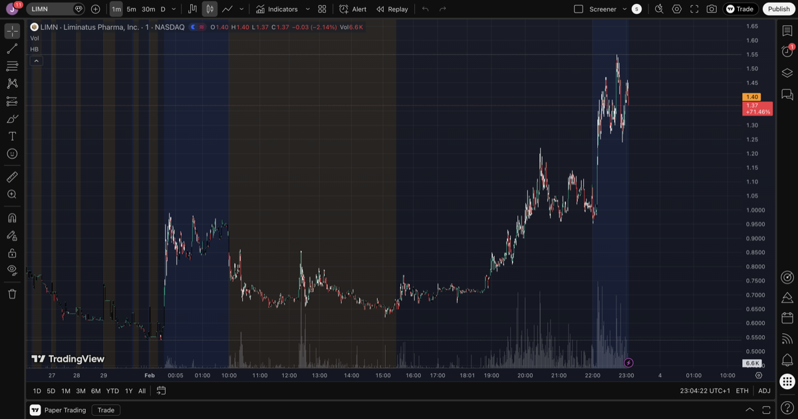

# Post-Market Screening - 2026-02-03

## Candidates

### LIMN - Liminatus Pharma
- **AH Price:** $1.42 (+31.78%)
- **Previous Close:** $0.57
- **Regular Close:** $1.07 (+87%)
- **Float:** N/A
- **Market Cap:** $28.96M
- **Catalyst:** Unknown — not checked (disqualified on price/volume rules)
- **Volume:** 81.8M regular, 26K AH (fading)
- **Decision:** Skip
- **Reason:** Already +87% in regular session, +149% above previous close — violates >50% rule. Also NOT first day of unusual volume (Feb 2 had 4.9M vs ~100K normal). AH volume fading (26K vs 81M regular).
- **Chart note:** AH price action is actually building, not fading. Stock consolidated $0.90-$1.07 during regular hours, then broke out in AH to $1.55. If we had caught this on Feb 2 when it first spiked to $0.85 (day 1 of volume), that would have been the right entry at ~50% above prev close.

### FEMY - Femasys Inc
- **AH Price:** $0.58 (+14.64%)
- **Previous Close:** $0.52
- **Market Cap:** $31.14M
- **Volume:** 844K regular, 7.2K AH
- **Decision:** Skip
- **Reason:** Tiny AH volume (7K), no real momentum building.

### FEED - ENVue Medical
- **AH Price:** $2.70 (+9.76%)
- **Previous Close:** $2.42
- **Market Cap:** $2.68M
- **Volume:** 2.6M regular, 0 AH
- **Decision:** Skip
- **Reason:** Zero AH volume — no real after-hours activity.

### ONCY - Oncolytics Biotech
- **AH Price:** $0.94 (+7.88%)
- **Previous Close:** $0.97
- **Market Cap:** $94.46M
- **Volume:** 1.3M regular, 0 AH
- **Decision:** Skip
- **Reason:** Zero AH volume. Actually down on the day (-9.35%).

### DRMA - Dermata Therapeutics
- **AH Price:** $1.98 (+7.55%)
- **Previous Close:** $2.02
- **Market Cap:** $5.22M
- **Volume:** 242K regular, 0 AH
- **Decision:** Skip
- **Reason:** Zero AH volume, no unusual activity.

## Summary

No actionable candidates tonight. The only stock with real AH activity (LIMN) was disqualified by the >50% rule and prior-day volume rule. All other biotech/pharma names had zero or negligible AH volume.
