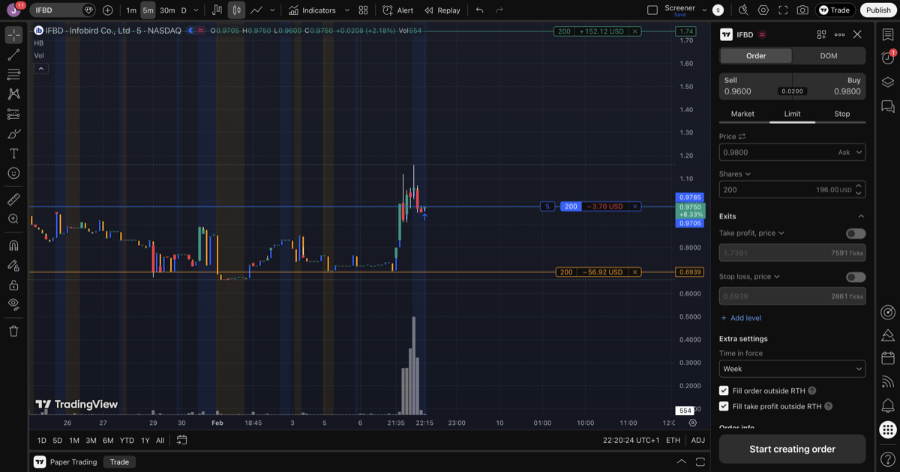
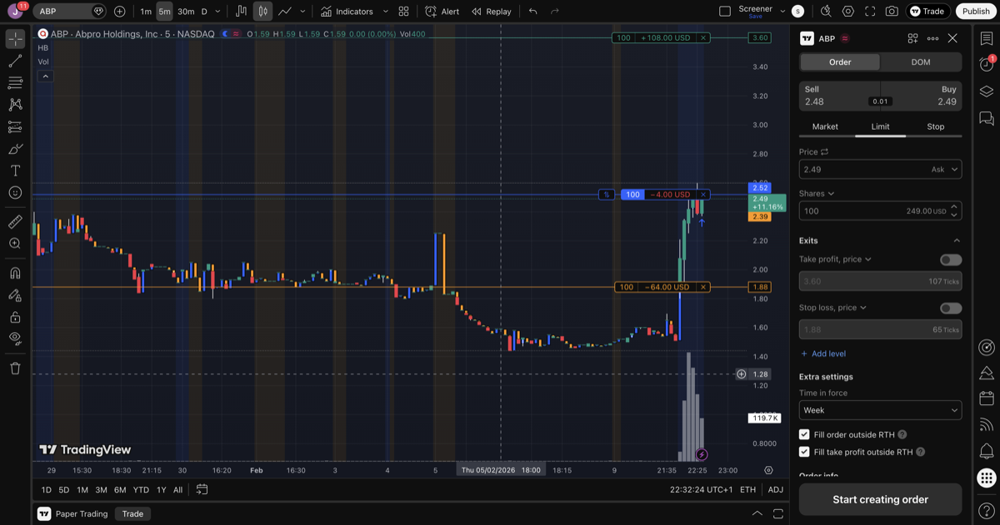

# Post-Market Screening - 2026-02-09

## Scanner Results

Initial custom scanner (biotech + all sectors): **0 hits** at 4:05 PM ET — no stocks passed both 50K AH volume and 5% AH change thresholds. Later scans picked up IFBD (4:16 PM ET) and ABP/ENSC/AEHL (4:28 PM ET) as volume built.

TradingView AH gainers page reviewed manually at session start.

## Candidates

### ENSC - Ensysce Biosciences
- **AH Price:** $0.64 (+5.28%)
- **Previous Close:** $0.46
- **Regular Close:** $0.608 (+31.77% on the day)
- **Float:** 3.62M
- **Market Cap:** $2.11M
- **AH Volume:** 100.89K
- **Avg Volume:** 222.68K
- **Catalyst:** None — Finviz says "No clear catalyst identified for the 20.07% intraday gain"
- **Volume trend (5d):** 147K → 159K → 205K → 327K → 1.18M (escalating!)
- **Decision:** Skip
- **Reason:** No catalyst (no-news pump). Volume has been escalating over the last 5 days — not a first day of unexpected volume. Already up 31% on the day, AH is just continuation. High risk of fade.

### SLXN - Silexion Therapeutics
- **AH Price:** $1.87 (+6.86%)
- **Previous Close:** $1.61
- **Regular Close:** $1.75 (+8.70% on the day)
- **Float:** 2.31M
- **Market Cap:** $5.37M
- **AH Volume:** 866 (meaningless)
- **Avg Volume:** 53.84K
- **Catalyst:** None fresh. Last news: Jan 21 (RNAi summit attendance)
- **Decision:** Skip
- **Reason:** AH volume of 866 shares is meaningless — likely a single trade that moved the price on zero liquidity. No catalyst.

### SSKN - STRATA Skin Sciences
- **AH Price:** $1.23 (+6.03%)
- **Previous Close:** $1.07
- **Regular Close:** $1.16 (+8.41% on the day)
- **Float:** 3.93M
- **Market Cap:** $6.95M
- **AH Volume:** 39.55K
- **Avg Volume:** 93.39K
- **Catalyst:** None fresh. Last news: Dec 2025
- **Short Float:** 6.85%
- **Decision:** Skip
- **Reason:** Medical Devices sector (not biotech/pharma — violates sector discipline). No catalyst. Volume 10x avg today but no news driver.

### AEHL - Antelope Enterprise Holdings
- **AH Price:** $0.82 (+16.89%)
- **Previous Close:** $0.69
- **Regular Close:** $0.70 (+1.39% on the day)
- **Float:** N/A
- **Market Cap:** $6.49M
- **AH Volume:** 337.9K
- **Avg Volume:** ~63K (based on recent days)
- **Catalyst:** Not checked — not biotech
- **Volume trend (5d):** 354K → 74K → 93K → 474K → 75K (irregular, had spike on Feb 6)
- **Decision:** Skip
- **Reason:** Not biotech/pharma sector. Already had volume spike on Feb 6 (474K). Non-qualifying per sector discipline.

### IFBD - Infobird Co. Ltd (from scanner, 4:16 PM ET)
- **AH Price:** $1.15 (+10.6%)
- **Previous Close:** $0.70
- **Regular Close:** $1.04 (+48.55% on the day)
- **Float:** 8.2M
- **Market Cap:** $5.08M
- **AH Volume:** 188K
- **Avg Volume:** 17.57K (Rel Volume: 77.85x!)
- **Catalyst:** None — last news is from May 2024 (Nasdaq compliance notice)
- **Sector:** Technology - Software (Hong Kong)
- **Decision:** Buy
- **Entry:** $0.9785, 200 shares (~$195.70) at 22:20 CET
- **Take Profit:** $1.7391 (+77.7%)
- **Stop Loss:** $0.6939 (-29.1%)
- **Risk/Reward:** ~1:2.7
- **Plan:** Exit in premarket before 9:30 AM ET (15:30 CET)
- **Note:** Violates sector discipline (not biotech) and no-catalyst rule. Stop losses do NOT execute in extended hours — accept full loss potential.

### ABP - Abpro Holdings Inc (from scanner, 4:28 PM ET)
- **AH Price:** $2.52 (+65.8% at time of entry)
- **Previous Close:** $1.50
- **Regular Close:** $1.52 (+1.33% on the day)
- **Float:** 1.7M
- **Market Cap:** ~$4.5M
- **AH Volume:** 434K+
- **Avg Volume:** 27.26K (Rel Volume: 25.57x)
- **Catalyst:** FDA IND Clearance for ABP-102/CT-P72 (Jan 6). Goldman Sachs 6% stake rumor. J.P. Morgan Healthcare Conference presentation (Jan 15).
- **Sector:** Healthcare - Biotechnology ✅
- **Volume trend (5d):** 11K → 10K → 52K → 15K → 697K (first day of major spike)
- **Decision:** Buy
- **Entry:** $2.52, 100 shares ($252) at 22:30 CET
- **Take Profit:** $3.60 (+42.9%)
- **Stop Loss:** $1.88 (-25.4%)
- **Risk/Reward:** ~1:1.7
- **Plan:** Exit in premarket before 9:30 AM ET (15:30 CET)
- **Note:** Entry at +68% above prev close — exceeds the 50% rule. Stop losses do NOT execute in extended hours.

## Scanner Follow-Up

Ran custom scanner with 5-min intervals:
- **4:05 PM ET:** 0 hits (initial scan, biotech + all sectors)
- **4:11 PM ET:** 0 hits
- **4:16 PM ET:** 1 hit — IFBD (bought)
- **4:28 PM ET:** 3 hits — ENSC (+19.6%, 2M AH vol), AEHL (+24.1%, 1.7M AH vol), ABP (+38.8%, 434K AH vol) — ABP bought

## Summary

**2 trades taken.** Slow start to AH session — initial scan returned 0 hits. Volume built over time as AH progressed.

### Positions Open (overnight holds)

| Ticker | Entry | Shares | Cost | TP | SL | Sector |
|--------|-------|--------|------|----|----|--------|
| IFBD | $0.9785 | 200 | $195.70 | $1.7391 | $0.6939 | Tech/Software ⚠️ |
| ABP | $2.52 | 100 | $252.00 | $3.60 | $1.88 | Biotech ✅ |
| **Total** | | | **$447.70** | | | |

### Skipped
- **ENSC** — no catalyst, multi-day escalating volume
- **SLXN** — meaningless AH volume (866 shares)
- **SSKN** — medical devices (sector violation), no catalyst
- **AEHL** — not biotech, prior volume spike

### Rule Violations
- **IFBD:** Violates sector discipline (not biotech) and no-catalyst rule
- **ABP:** Entry at +68% above prev close — exceeds the 50% rule
- Both positions: stop losses will NOT execute in extended hours

### Plan
- Exit both positions in premarket before 9:30 AM ET (15:30 CET)
