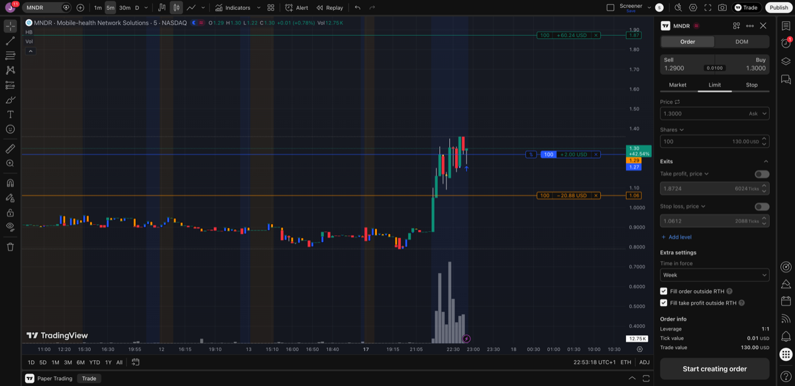

# Post-Market Screening - 2026-02-17

## Scan Results

| Ticker | Close | AH Chg | AH Price | AH Vol | VRatio | Float | MCap | Industry |
|--------|-------|--------|----------|--------|--------|-------|------|----------|
| MNDR | $0.88 | +48.9% | $1.31 | 3.9M | 6.8x | 2.4M | $2.6M | Medical/Nursing Services |
| JDZG | $0.72 | +59.7% | $1.15 | 3.2M | 0.2x | 42K | $89M | Misc Commercial Services |
| YCBD | $0.78 | +15.8% | $0.90 | 733K | 1.1x | 8.9M | $8.1M | Pharmaceuticals |
| QMCO | $5.61 | +23.7% | $6.94 | 631K | 1.0x | 13.1M | $77M | Computer Peripherals |

## Candidates

### MNDR
- **AH Price:** $1.31 (+48.9%)
- **Previous Close:** $0.88
- **Float:** 2.4M
- **Market Cap:** $2.6M
- **Catalyst:** No news found — no clear catalyst
- **Volume:** 3.9M AH (6.8x average)
- **Decision:** Buy
- **Reason:** Tiny float (2.4M), massive volume ratio (6.8x), micro cap. No catalyst is a risk but volume conviction is strong.
- **Entry:** 100 shares @ $1.27 (filled ~22:49 CET)
- **Position size:** $127
- **Entry vs close:** +44.3% above previous close

### YCBD
- **AH Price:** $0.90 (+15.8%)
- **Previous Close:** $0.78
- **Float:** 8.9M
- **Market Cap:** $8.1M
- **Catalyst:** Earnings beat — Q1 revenue $5.0M (+12% seq), EPS beat by 33%, cash to $3.4M
- **Volume:** 733K AH (1.1x average)
- **Decision:** Skip
- **Reason:** Modest move, low volume ratio, pharma but not biotech

### QMCO
- **AH Price:** $6.94 (+23.7%)
- **Previous Close:** $5.61
- **Float:** 13.1M
- **Market Cap:** $77M
- **Catalyst:** Earnings beat — Q3 revenue $74.6M topped guidance, positive EBITDA, debt reduction
- **Volume:** 631K AH (1.0x average)
- **Decision:** Skip
- **Reason:** Not biotech (0% win rate on non-biotech), float too high

### JDZG
- **Decision:** Skip
- **Reason:** Volume ratio only 0.2x (below daily average), not biotech
