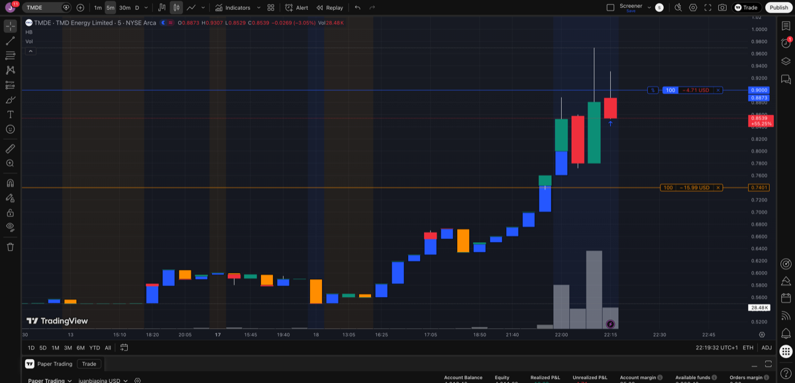

# Post-Market Screening - 2026-02-18

## Scan Results

| Ticker | Close | AH Chg | AH Price | AH Vol | VRatio | Float | MCap | Industry |
|--------|-------|--------|----------|--------|--------|-------|------|----------|
| AUUD | $1.14 | +7.9% | $1.23 | 218K | 0.0x | 3.1M | $3.5M | Packaged Software |
| TMDE | $0.76 | +9.0% | $0.83 | 113K | 0.5x | 0 | $17.9M | Wholesale Distributors |

## Candidates

### TMDE
- **AH Price:** $0.85 (+9.0%)
- **Previous Close:** $0.76
- **Float:** Unknown
- **Market Cap:** $17.9M
- **Catalyst:** TBD
- **Volume:** 113K AH (0.5x average)
- **Decision:** Buy
- **Entry:** 100 shares @ $0.9000 (filled 22:19 CET)
- **Position size:** $90.00
- **Stop loss:** $0.7401
- **Take profit:** $1.2512
- **Entry vs close:** +18.4% above previous close
- **⚠️ Not biotech** — violates sector discipline rule

### AUUD
- **Decision:** Skip (opened chart only)
